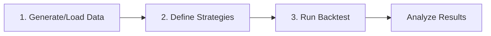

# Quickstart

This guide walks you through running your first AMM liquidity provider backtest with ammBT. By the end, you'll understand the basic workflow and be ready to explore more advanced features.

## The Basic Workflow

Every ammBT backtest follows three steps:



## Step 1: Import and Generate Data

```python
import ammbt as amm

# Generate synthetic swap data
swaps = amm.generate_swaps(
    n_swaps=5000,           # Number of swap events
    initial_price=1.0,       # Starting price (token1/token0)
    price_volatility=0.02,   # Daily volatility
    seed=42                  # For reproducibility
)

print(swaps.head())
```

Output:

```
   amount0    amount1     price   timestamp     volume
0   523.45   -521.23  1.004234  1700000000   521.2345
1  -312.67    314.89  0.996745  1700000015   314.8923
2   189.23   -188.45  1.002341  1700000030   188.4567
...
```

<Note>
The swap data represents trades happening in the pool. Positive `amount0` means tokens flowing into the pool, negative means flowing out.
</Note>

## Step 2: Define Strategies

Define the strategies you want to test. For Uniswap V2, you only need to specify initial capital and rebalancing parameters:

```python
strategies = {
    'initial_capital': [10000, 25000, 50000],
    'rebalance_threshold': [0.0, 0.05, 0.10],  # Price change triggers
    'rebalance_frequency': [0, 200],            # Min swaps between rebalances
}
```

This creates a grid of 3 × 3 × 2 = **18 strategy combinations** to test.

## Step 3: Run the Backtest

```python
# Create backtester for Uniswap V2
bt = amm.LPBacktester(amm_type='v2')

# Run all strategies
result = bt.run(swaps, strategies)

print(f"Tested {len(result.metrics)} strategies")
```

## Step 4: Analyze Results

### View Top Strategies

```python
# Get summary sorted by net PnL
summary = result.summary()
print(summary.head())
```

Output:

```
   initial_capital  rebalance_threshold  rebalance_frequency    net_pnl  total_return_pct  sharpe  max_drawdown_pct
0            50000                 0.10                  200   1523.45              3.05    1.23              2.34
1            25000                 0.05                  200    789.23              3.16    1.31              2.12
2            50000                 0.05                  200    756.89              1.51    1.18              2.45
...
```

### View Detailed Metrics

```python
# All available metrics
print(result.metrics.columns.tolist())
```

```
['initial_capital', 'rebalance_threshold', 'rebalance_frequency',
 'net_pnl', 'total_return_pct', 'sharpe', 'max_drawdown_pct',
 'total_fees_earned', 'impermanent_loss', 'num_rebalances',
 'gas_spent', 'time_in_position']
```

### Get Position History

```python
# Get detailed position history for best strategy
best_idx = summary.index[0]
history = result.get_position_history(best_idx)

print(history.tail())
```

```
      liquidity  token0_balance  token1_balance  uncollected_fees_0  uncollected_fees_1  is_active  num_rebalances
4995   51234.56        25123.45        26234.56              234.56              245.67       True               3
4996   51234.56        25089.12        26278.90              235.12              246.23       True               3
4997   51234.56        25054.78        26323.24              235.68              246.79       True               3
...
```

## Step 5: Visualize Results

### Performance Chart

```python
fig = amm.plot_performance(result, strategy_idx=best_idx)
fig.show()
```

<Frame>
  
</Frame>

### Compare All Strategies

```python
# Heatmap of results
fig = amm.plot_metrics_heatmap(
    result,
    x_param='rebalance_threshold',
    y_param='initial_capital',
    metric='total_return_pct'
)
fig.show()
```

<Frame>
  
</Frame>

## Complete Example

Here's the complete code:

```python
import ammbt as amm

# 1. Generate swap data
swaps = amm.generate_swaps(
    n_swaps=5000,
    price_volatility=0.02,
    seed=42
)

# 2. Define strategies
strategies = {
    'initial_capital': [10000, 25000, 50000],
    'rebalance_threshold': [0.0, 0.05, 0.10],
    'rebalance_frequency': [0, 200],
}

# 3. Run backtest
bt = amm.LPBacktester(amm_type='v2')
result = bt.run(swaps, strategies)

# 4. Analyze
summary = result.summary()
print("Top 5 Strategies:")
print(summary.head())

# 5. Visualize
fig = amm.plot_performance(result, strategy_idx=0)
fig.show()
```

## Try Different AMMs

### Uniswap V3 (Concentrated Liquidity)

```python
# V3 requires tick ranges
strategies_v3 = {
    'initial_capital': [10000, 25000],
    'tick_lower': [-200, -400],
    'tick_upper': [200, 400],
    'rebalance_threshold': [0.0, 0.05],
}

bt_v3 = amm.LPBacktester(amm_type='v3', fee_tier=3000)
result_v3 = bt_v3.run(swaps, strategies_v3)
```

### Meteora DLMM

```python
# DLMM uses bin ranges
strategies_dlmm = {
    'initial_capital': [10000, 25000],
    'bin_lower': [-40, -80],
    'bin_upper': [40, 80],
    'liquidity_shape': [0, 1],  # 0=Spot, 1=Curve
}

bt_dlmm = amm.LPBacktester(amm_type='dlmm', bin_step=25)
result_dlmm = bt_dlmm.run(swaps, strategies_dlmm)
```

## What's Next?

<CardGroup cols={2}>
  <Card title="First Backtest Deep Dive" icon="book-open" href="/getting-started/first-backtest">
    Detailed walkthrough of backtest components
  </Card>
  <Card title="Understanding AMMs" icon="lightbulb" href="/tutorials/beginner/understanding-amms">
    Learn how different AMM types work
  </Card>
  <Card title="V3 Backtesting" icon="chart-mixed" href="/tutorials/intermediate/uniswap-v3-backtesting">
    Master concentrated liquidity strategies
  </Card>
  <Card title="Examples Gallery" icon="images" href="/examples/gallery">
    Browse complete example notebooks
  </Card>
</CardGroup>
