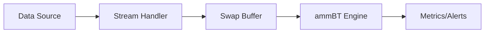

# Live Swap Streaming

This tutorial covers connecting ammBT to real-time swap data streams for paper trading and live strategy monitoring. You'll learn how to stream from various sources and integrate with the backtesting engine.

## Architecture Overview



## WebSocket Streaming

### Uniswap V3 via The Graph

```python
import asyncio
import websockets
import json
import pandas as pd
from datetime import datetime

class UniswapV3StreamHandler:
    """Stream Uniswap V3 swaps via WebSocket."""

    def __init__(self, pool_address: str, callback):
        self.pool_address = pool_address.lower()
        self.callback = callback
        self.ws_url = "wss://api.thegraph.com/subgraphs/name/uniswap/uniswap-v3"

    async def subscribe(self):
        """Subscribe to swap events."""

        subscription = {
            "type": "start",
            "payload": {
                "query": f"""
                    subscription {{
                        swaps(
                            where: {{ pool: "{self.pool_address}" }}
                            orderBy: timestamp
                            orderDirection: desc
                            first: 1
                        ) {{
                            amount0
                            amount1
                            sqrtPriceX96
                            timestamp
                        }}
                    }}
                """
            }
        }

        async with websockets.connect(self.ws_url, subprotocols=["graphql-ws"]) as ws:
            await ws.send(json.dumps({"type": "connection_init"}))
            await ws.recv()  # Ack

            await ws.send(json.dumps(subscription))

            while True:
                message = await ws.recv()
                data = json.loads(message)

                if data.get("type") == "data":
                    swaps = data["payload"]["data"]["swaps"]
                    for swap in swaps:
                        self.callback(self._parse_swap(swap))

    def _parse_swap(self, raw_swap: dict) -> dict:
        """Parse raw swap data into standard format."""
        sqrt_price = float(raw_swap['sqrtPriceX96'])
        price = (sqrt_price / (2 ** 96)) ** 2

        return {
            'amount0': float(raw_swap['amount0']),
            'amount1': float(raw_swap['amount1']),
            'price': price,
            'timestamp': int(raw_swap['timestamp']),
        }
```

### Solana/Meteora Streaming

```python
from solana.rpc.websocket_api import connect
from solana.publickey import PublicKey

class MeteoraStreamHandler:
    """Stream Meteora DLMM swaps via Solana WebSocket."""

    def __init__(self, pool_address: str, callback):
        self.pool_address = PublicKey(pool_address)
        self.callback = callback
        self.ws_url = "wss://api.mainnet-beta.solana.com"

    async def subscribe(self):
        """Subscribe to account changes."""

        async with connect(self.ws_url) as ws:
            await ws.account_subscribe(
                self.pool_address,
                commitment="confirmed",
                encoding="jsonParsed",
            )

            async for msg in ws:
                if 'result' in msg:
                    continue  # Subscription confirmation

                # Parse account data for swap events
                account_data = msg['params']['result']['value']['data']
                swap = self._parse_account_data(account_data)
                if swap:
                    self.callback(swap)

    def _parse_account_data(self, data) -> dict:
        """Parse Meteora account data for swap info."""
        # Implementation depends on DLMM program structure
        # This is a placeholder
        pass
```

## Swap Buffer

Buffer incoming swaps for batch processing:

```python
import threading
from collections import deque
from typing import Callable, List

class SwapBuffer:
    """Thread-safe buffer for incoming swaps."""

    def __init__(self, max_size: int = 10000):
        self.swaps = deque(maxlen=max_size)
        self.lock = threading.Lock()
        self.callbacks: List[Callable] = []

    def add(self, swap: dict):
        """Add a swap to the buffer."""
        with self.lock:
            self.swaps.append(swap)

        # Notify callbacks
        for cb in self.callbacks:
            cb(swap)

    def get_dataframe(self, n: int = None) -> pd.DataFrame:
        """Get swaps as DataFrame."""
        with self.lock:
            if n is None:
                data = list(self.swaps)
            else:
                data = list(self.swaps)[-n:]

        if not data:
            return pd.DataFrame(columns=['amount0', 'amount1', 'price', 'timestamp'])

        return pd.DataFrame(data)

    def on_swap(self, callback: Callable):
        """Register callback for new swaps."""
        self.callbacks.append(callback)

    def clear(self):
        """Clear the buffer."""
        with self.lock:
            self.swaps.clear()
```

## Live Paper Trading

```python
import ammbt as amm
import time
from datetime import datetime

class LivePaperTrader:
    """Paper trade LP strategies with live data."""

    def __init__(
        self,
        amm_type: str = 'v3',
        strategies: dict = None,
        update_interval: int = 60,  # seconds
        **bt_kwargs
    ):
        self.bt = amm.LPBacktester(amm_type=amm_type, **bt_kwargs)
        self.strategies = strategies or {'initial_capital': [10000]}
        self.buffer = SwapBuffer()
        self.update_interval = update_interval

        self.current_result = None
        self.metrics_history = []
        self.running = False

    def on_new_swap(self, swap: dict):
        """Handle new swap event."""
        self.buffer.add(swap)

    async def start(self, stream_handler):
        """Start paper trading."""
        self.running = True

        # Start background update loop
        update_task = asyncio.create_task(self._update_loop())

        # Start streaming
        try:
            await stream_handler.subscribe()
        finally:
            self.running = False
            update_task.cancel()

    async def _update_loop(self):
        """Periodically update metrics."""
        while self.running:
            await asyncio.sleep(self.update_interval)

            swaps = self.buffer.get_dataframe()
            if len(swaps) < 10:
                continue

            # Run backtest on buffered data
            self.current_result = self.bt.run(swaps, self.strategies)

            # Record metrics
            timestamp = datetime.now()
            metrics = self.current_result.summary().iloc[0].to_dict()
            metrics['timestamp'] = timestamp
            self.metrics_history.append(metrics)

            self._log_update(metrics)

    def _log_update(self, metrics: dict):
        """Log current status."""
        print(f"[{metrics['timestamp']}] Swaps: {len(self.buffer.swaps)}, "
              f"PnL: ${metrics['net_pnl']:.2f}, "
              f"Return: {metrics['total_return_pct']:.2f}%")

    def get_current_metrics(self) -> dict:
        """Get latest metrics."""
        if self.metrics_history:
            return self.metrics_history[-1]
        return {}

    def get_metrics_history(self) -> pd.DataFrame:
        """Get full metrics history."""
        return pd.DataFrame(self.metrics_history)
```

## Usage Example

```python
import asyncio
import ammbt as amm

async def main():
    # Define strategies to paper trade
    strategies = {
        'initial_capital': [10000, 25000],
        'tick_lower': [-200, -400],
        'tick_upper': [200, 400],
        'rebalance_threshold': [0.0, 0.05],
    }

    # Create paper trader
    trader = LivePaperTrader(
        amm_type='v3',
        strategies=strategies,
        update_interval=60,
        fee_tier=3000,
    )

    # Create stream handler
    pool_address = "0x8ad599c3a0ff1de082011efddc58f1908eb6e6d8"  # USDC-ETH
    stream = UniswapV3StreamHandler(pool_address, trader.on_new_swap)

    # Start trading
    print("Starting paper trading...")
    await trader.start(stream)

# Run
asyncio.run(main())
```

## Alerting System

```python
from typing import List, Dict
import smtplib
from email.mime.text import MIMEText

class AlertManager:
    """Manage alerts for paper trading."""

    def __init__(self):
        self.thresholds = {
            'max_drawdown': 10.0,  # Alert if drawdown > 10%
            'min_sharpe': 0.5,      # Alert if Sharpe < 0.5
            'max_rebalances': 10,   # Alert if too many rebalances
        }
        self.email_config = None

    def configure_email(self, smtp_host: str, smtp_port: int,
                       username: str, password: str, recipients: List[str]):
        """Configure email alerts."""
        self.email_config = {
            'host': smtp_host,
            'port': smtp_port,
            'username': username,
            'password': password,
            'recipients': recipients,
        }

    def check_metrics(self, metrics: Dict) -> List[str]:
        """Check metrics against thresholds."""
        alerts = []

        if metrics.get('max_drawdown_pct', 0) > self.thresholds['max_drawdown']:
            alerts.append(f"High drawdown: {metrics['max_drawdown_pct']:.1f}%")

        if metrics.get('sharpe', 1) < self.thresholds['min_sharpe']:
            alerts.append(f"Low Sharpe ratio: {metrics['sharpe']:.2f}")

        if metrics.get('num_rebalances', 0) > self.thresholds['max_rebalances']:
            alerts.append(f"Many rebalances: {metrics['num_rebalances']}")

        return alerts

    def send_alert(self, alerts: List[str]):
        """Send alert notification."""
        if not alerts:
            return

        message = "Paper Trading Alerts:\n\n" + "\n".join(alerts)
        print(f"ALERT: {message}")

        if self.email_config:
            self._send_email(message)

    def _send_email(self, message: str):
        """Send email alert."""
        msg = MIMEText(message)
        msg['Subject'] = 'ammBT Paper Trading Alert'
        msg['From'] = self.email_config['username']
        msg['To'] = ', '.join(self.email_config['recipients'])

        with smtplib.SMTP(self.email_config['host'],
                         self.email_config['port']) as server:
            server.starttls()
            server.login(self.email_config['username'],
                        self.email_config['password'])
            server.send_message(msg)

# Integration with paper trader
alert_manager = AlertManager()

def on_metrics_update(metrics):
    alerts = alert_manager.check_metrics(metrics)
    if alerts:
        alert_manager.send_alert(alerts)
```

## Real-Time Dashboard

```python
import plotly.graph_objects as go
from plotly.subplots import make_subplots
import dash
from dash import dcc, html
from dash.dependencies import Input, Output

def create_dashboard(trader: LivePaperTrader):
    """Create real-time monitoring dashboard."""

    app = dash.Dash(__name__)

    app.layout = html.Div([
        html.H1("ammBT Paper Trading Dashboard"),

        html.Div([
            html.Div([
                html.H3("Current Metrics"),
                html.Div(id='current-metrics'),
            ], className='six columns'),

            html.Div([
                html.H3("Strategy Performance"),
                dcc.Graph(id='performance-chart'),
            ], className='six columns'),
        ], className='row'),

        html.Div([
            html.H3("Metrics History"),
            dcc.Graph(id='metrics-history-chart'),
        ]),

        dcc.Interval(
            id='interval-component',
            interval=5000,  # Update every 5 seconds
            n_intervals=0
        )
    ])

    @app.callback(
        Output('current-metrics', 'children'),
        Input('interval-component', 'n_intervals')
    )
    def update_metrics(n):
        metrics = trader.get_current_metrics()
        if not metrics:
            return "Waiting for data..."

        return html.Div([
            html.P(f"Net PnL: ${metrics.get('net_pnl', 0):.2f}"),
            html.P(f"Return: {metrics.get('total_return_pct', 0):.2f}%"),
            html.P(f"Sharpe: {metrics.get('sharpe', 0):.2f}"),
            html.P(f"Max Drawdown: {metrics.get('max_drawdown_pct', 0):.2f}%"),
            html.P(f"Rebalances: {metrics.get('num_rebalances', 0)}"),
        ])

    @app.callback(
        Output('metrics-history-chart', 'figure'),
        Input('interval-component', 'n_intervals')
    )
    def update_history_chart(n):
        history = trader.get_metrics_history()
        if history.empty:
            return go.Figure()

        fig = make_subplots(rows=2, cols=1,
                          subplot_titles=['Net PnL', 'Sharpe Ratio'])

        fig.add_trace(
            go.Scatter(x=history['timestamp'], y=history['net_pnl'],
                      name='Net PnL'),
            row=1, col=1
        )

        fig.add_trace(
            go.Scatter(x=history['timestamp'], y=history['sharpe'],
                      name='Sharpe'),
            row=2, col=1
        )

        fig.update_layout(height=500)
        return fig

    return app

# Run dashboard
# app = create_dashboard(trader)
# app.run_server(debug=True, port=8050)
```

## Best Practices

<Check>
Buffer swaps to avoid processing every single event
</Check>

<Check>
Set appropriate update intervals (30-60 seconds typical)
</Check>

<Check>
Implement alerts for critical thresholds
</Check>

<Check>
Log all metrics for post-analysis
</Check>

<Check>
Handle connection drops gracefully
</Check>

<Check>
Test with synthetic data before connecting to live streams
</Check>

## Caveats

<Warning>
Paper trading doesn't account for slippage or MEV
</Warning>

<Warning>
Real execution may differ from simulated results
</Warning>

<Warning>
WebSocket connections can drop - implement reconnection logic
</Warning>

<Warning>
Rate limits may apply to data sources
</Warning>

## What's Next?

<CardGroup cols={2}>
  <Card title="Examples Gallery" icon="images" href="/examples/gallery">
    See complete implementation examples
  </Card>
  <Card title="API Reference" icon="book" href="/api-reference/overview">
    Full API documentation
  </Card>
</CardGroup>
