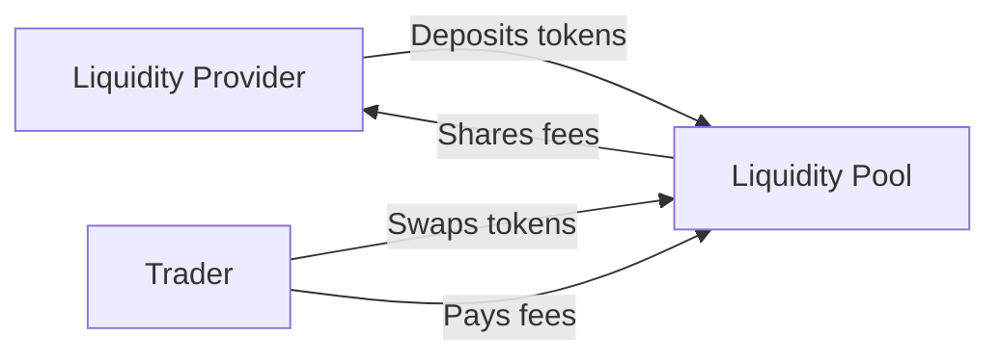

# Understanding Automated Market Makers

Before diving into backtesting, it's essential to understand how AMMs work. This knowledge will help you design better strategies and interpret backtest results.

## What is an AMM?

An **Automated Market Maker (AMM)** is a decentralized exchange protocol that uses mathematical formulas to price assets. Instead of matching buyers and sellers via order books, AMMs use **liquidity pools** funded by **liquidity providers (LPs)**.



## The Liquidity Provider's Role

As an LP, you:

1. **Deposit tokens** into a pool (e.g., ETH and USDC)
2. **Earn trading fees** from every swap
3. **Face impermanent loss** when prices change
4. **Manage positions** by rebalancing when needed

The goal of backtesting is to find strategies that maximize fee income while minimizing impermanent loss.

## AMM Types Supported by ammBT

<CardGroup cols={3}>
  <Card title="CPAMM (V2)" icon="circle">
    Constant Product AMM
    Full-range liquidity
  </Card>
  <Card title="CLMM (V3)" icon="arrows-left-right-to-line">
    Concentrated Liquidity
    Custom price ranges
  </Card>
  <Card title="DLMM" icon="grid-2">
    Dynamic Liquidity
    Bin-based with variable fees
  </Card>
</CardGroup>

### 1. Constant Product AMM (Uniswap V2)

The simplest AMM type, using the formula:

$$x \cdot y = k$$

Where:
- $x$ = reserve of token0
- $y$ = reserve of token1
- $k$ = constant product

**Key Characteristics:**
- Liquidity spread across all prices (0 to ∞)
- Lower capital efficiency but simpler management
- Same fee rate for all LPs (typically 0.3%)

```python
# V2 backtest setup
bt = amm.LPBacktester(amm_type='v2')
strategies = {
    'initial_capital': [10000],
    'rebalance_threshold': [0.05],
}
```

### 2. Concentrated Liquidity (Uniswap V3)

Allows LPs to provide liquidity within specific **price ranges** using **ticks**:

$$L = \frac{\Delta y}{\Delta \sqrt{P}}$$

**Key Characteristics:**
- Liquidity concentrated in custom ranges
- Higher capital efficiency (up to 4000x)
- Position earns fees only when price is in range
- Multiple fee tiers (0.05%, 0.3%, 1%)

```python
# V3 backtest setup
bt = amm.LPBacktester(
    amm_type='v3',
    fee_tier=3000  # 0.3% tier
)
strategies = {
    'initial_capital': [10000],
    'tick_lower': [-200],
    'tick_upper': [200],
}
```

### 3. Dynamic Liquidity Market Maker (Meteora DLMM)

A Solana-based AMM with **bins** instead of ticks:

**Key Characteristics:**
- Discrete price bins (not continuous)
- Dynamic fees based on volatility
- Multiple liquidity distribution shapes
- Lower gas costs (Solana)

```python
# DLMM backtest setup
bt = amm.LPBacktester(
    amm_type='dlmm',
    bin_step=25  # 0.25% per bin
)
strategies = {
    'initial_capital': [10000],
    'bin_lower': [-40],
    'bin_upper': [40],
    'liquidity_shape': [0],  # Uniform
}
```

## Understanding Impermanent Loss

**Impermanent Loss (IL)** is the cost of providing liquidity compared to simply holding the tokens.

### IL in V2 (CPAMM)

For a price change from $P_0$ to $P_1$:

$$IL = 2 \cdot \sqrt{\frac{P_1}{P_0}} / (1 + \frac{P_1}{P_0}) - 1$$

| Price Change | Impermanent Loss |
|--------------|------------------|
| 1.25x | 0.6% |
| 1.50x | 2.0% |
| 2.00x | 5.7% |
| 3.00x | 13.4% |
| 5.00x | 25.5% |

### IL in V3 (Concentrated Liquidity)

IL is magnified by concentration. Narrower ranges = higher IL per price move.

For a position with range $[P_a, P_b]$ and current price $P$:

- **In-range**: Position earns fees but faces higher IL
- **Out-of-range**: No IL accrual, but also no fee income

```python
# Narrow range = more fees but more IL risk
narrow = {'tick_lower': [-100], 'tick_upper': [100]}

# Wide range = less fees but less IL risk
wide = {'tick_lower': [-1000], 'tick_upper': [1000]}
```

## Fee Economics

LPs earn a percentage of every swap:

| Protocol | Fee Tiers |
|----------|-----------|
| Uniswap V2 | 0.3% |
| Uniswap V3 | 0.05%, 0.3%, 1.0% |
| Meteora DLMM | Dynamic (0.1% - 2%+) |

### Fee Income Formula

For V2:
$$\text{Fees} = \text{Volume} \times \text{Fee Rate} \times \frac{\text{Your Liquidity}}{\text{Total Liquidity}}$$

For V3 (when in range):
$$\text{Fees} = \text{Volume} \times \text{Fee Rate} \times \frac{\text{Your Liquidity}}{L_{active}}$$

Where $L_{active}$ is only the liquidity within the current tick.

## Strategy Considerations

### V2 Strategy Questions

1. How much capital to deploy?
2. When to rebalance (if ever)?
3. Which token pairs to provide for?

### V3 Strategy Questions

1. How wide should my range be?
2. When should I rebalance out-of-range positions?
3. Which fee tier should I use?
4. Should I use multiple positions?

### DLMM Strategy Questions

1. Which liquidity shape (spot, curve, bid-ask)?
2. How many bins to cover?
3. How to handle dynamic fees?

## Why Backtest?

Backtesting helps you:

<Steps>
  <Step title="Test hypotheses">
    "Does a 5% range outperform a 10% range?"
  </Step>
  <Step title="Optimize parameters">
    Find the best rebalance threshold for given volatility
  </Step>
  <Step title="Understand risks">
    See worst-case drawdowns before committing capital
  </Step>
  <Step title="Compare strategies">
    Evaluate fee income vs. IL across different approaches
  </Step>
</Steps>

## Example: V2 vs V3 Comparison

```python
import ammbt as amm

# Same swap data for both
swaps = amm.generate_swaps(n_swaps=5000, price_volatility=0.02, seed=42)

# V2 backtest
bt_v2 = amm.LPBacktester(amm_type='v2')
result_v2 = bt_v2.run(swaps, {'initial_capital': [10000]})

# V3 backtest with equivalent capital
bt_v3 = amm.LPBacktester(amm_type='v3', fee_tier=3000)
result_v3 = bt_v3.run(swaps, {
    'initial_capital': [10000],
    'tick_lower': [-500],
    'tick_upper': [500],
})

# Compare
print(f"V2 Return: {result_v2.metrics['total_return_pct'].iloc[0]:.2f}%")
print(f"V3 Return: {result_v3.metrics['total_return_pct'].iloc[0]:.2f}%")
```

## Key Takeaways

<Check>
AMMs replace order books with mathematical pricing formulas
</Check>
<Check>
LPs earn fees but face impermanent loss
</Check>
<Check>
Concentrated liquidity (V3, DLMM) offers higher efficiency but requires active management
</Check>
<Check>
Backtesting helps optimize the fee/IL tradeoff
</Check>

## What's Next?

<Card title="Your First V2 Backtest" icon="play" href="/tutorials/beginner/your-first-v2-backtest">
  Put theory into practice with a hands-on V2 backtest
</Card>
